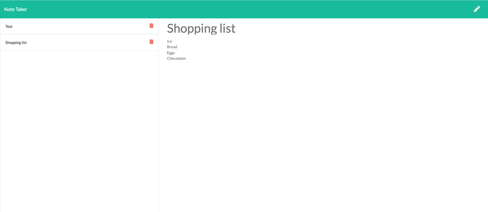

# Note Taker
  

  <h2>Table of Contents</h2>
  
  * [Description](#description)
  * [Usage](#usage)
  * [Installation](#install)
  * [Test](#test)
  * [License](#license)
  * [How to contribute](#contribution)
  * [Questions](#questions)
  
  
  ## Description
  This is an application to make developer's life easier when discribing their projects on a readme file. This will make the readme files look professional and provide a better project  understandig for developers and to other viewers.
  
  ## Usage
  To use the application give your note a title and a item, click save and it will be saved on the left side of the page. You can also delete all notes that you wish but the test note.
  
  ## Installation
  index.html
  
  ## Test
  no tests required
  
  ## License
  The application has a MIT license.
  
  ## How to contribute to this application
  message me on github or email
  
  ## Questions
  If you have any further questions, please feel free to contact me on GitHub at [ibarros19](https://github.com/ibarros19) or by email at [ivibarros19@gmail.com](ivibarros19@gmail.com).
  
  ## Deployed links
  
  Heroku:
  https://dashboard.heroku.com/apps/notakerivi/deploy/github
  
  Github repository:
 https://github.com/ibarros19/NoTaker
 
  ## Screenshot
  
  
